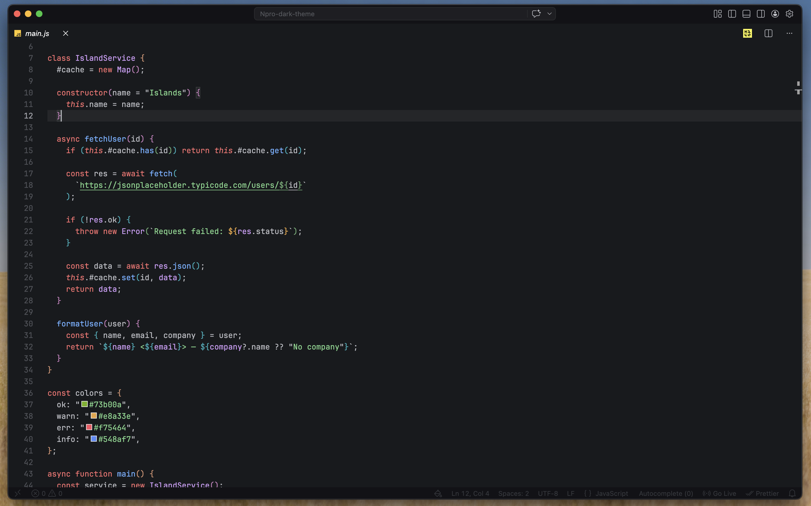
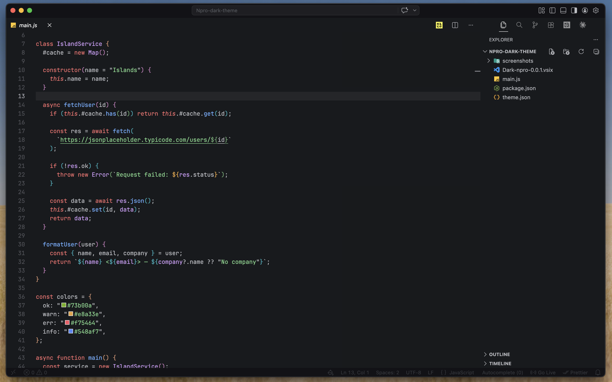

# 🏝️ Islands Dark

> A modern, dark theme for Visual Studio Code inspired by oceanic and island aesthetics.

Calm, deep tones designed for long coding sessions without eye strain.

---

## Features

| Feature | Description |
|---------|-------------|
| **Deep Background** | `#181a1d` — easy on the eyes for extended use |
| **Balanced Palette** | Carefully chosen colors for syntax clarity |
| **UI Consistency** | Follows VS Code conventions with unique touches |
| **High Readability** | Clear distinction between code elements |

---

## Color Palette

| Color | Hex | Usage |
|-------|-----|-------|
| Background | `#181a1d` | Editor, panels |
| Foreground | `#bcbec4` | Primary text |
| Accent Blue | `#548af7` | Keywords, links |
| Green | `#73b00a` | Strings, success |
| Red | `#f75464` | Errors, deletions |
| Orange | `#e8a33e` | Warnings, numbers |
| Purple | `#d09cf7` | Functions, special |
| Cyan | `#2aacb8` | Types, operators |

---

## Screenshots

> 
> 
> *JavaScript*

---

## Installation

### VS Code Marketplace

```bash
code --install-extension your-publisher.islands-dark
```

Or manually:

1. Open **Extensions** (`Ctrl+Shift+X`)
2. Search **"Islands Dark"**
3. Click **Install**

### Manual (VSIX)

1. Download `.vsix` from [Releases](../../releases)
2. Extensions → `...` → **Install from VSIX...**

### From Source

```bash
git clone https://github.com/your-username/islands-dark.git
cd islands-dark
npm install
npm run package
# Install generated .vsix
```

---

## Usage

`Ctrl+Shift+P` → **Color Theme** → **Islands Dark**

Or in `settings.json`:

```json
"workbench.colorTheme": "Islands Dark"
```

---

## Supported Languages

- JavaScript / TypeScript
- Python, Go, Rust
- HTML / CSS / SCSS
- JSON, YAML, Markdown
- And 50+ more

---

## Customization

Override in `settings.json`:

```json
"workbench.colorCustomizations": {
  "[Islands Dark]": {
    "editor.background": "#1e2024"
  }
}
```

---

## Contributing

1. Fork the repo
2. Create branch: `git checkout -b feature/xyz`
3. Test in Extension Development Host (`F5`)
4. Submit PR

---

## License

[MIT](LICENSE)

---

Made with ❤️ for late-night coding
